# Bilagh - Road Damage Detection App

React Native mobile app for detecting and reporting road damage.

## Features

- 🧠 **Hybrid AI Detection**: Uses a dual-model system (Keras + YOLOv8) for state-of-the-art accuracy.
- � **Dynamic Danger Scoring**: Automatically calculates damage severity from 0.0 to 1.0.
- �️ **Wide Map Coverage**: Interactive map with a 100km radius (40,000 km²) around Tiaret.
- � **Multimodal Roles**: Specialized workflows for Citizens, Agents, and Municipal authorities.
- 🌍 **Full i18n Support**: Native Arabic/English support with localized RTL layouts.
- 🔔 **Smart Notifications**: Real-time alerts for agents when municipal decisions are made.
- 📸 **Intelligent Feedback**: Distinguishes between clean roads and non-road images.

## AI Architecture

The system employs a **Conservative Hybrid Model** to minimize false positives:
1. **Primary Analysis (Keras)**: Analyzes the image for general road damage (85% confidence threshold).
2. **Type Verification (YOLOv8)**: If Keras detects damage, YOLOv8 identifies the specific category (Pothole, Crack, etc.).
3. **Validation logic**: Cross-references results. If verification fails, the image is flagged as "Clean Road" or "Not a Road" to ensure only real damage is reported.

## System Diagrams

### Use Case Diagram
Detailed mapping of user interactions (Citizen, Agent, Municipal Authority) with the AI detection system.
<div align="center">
  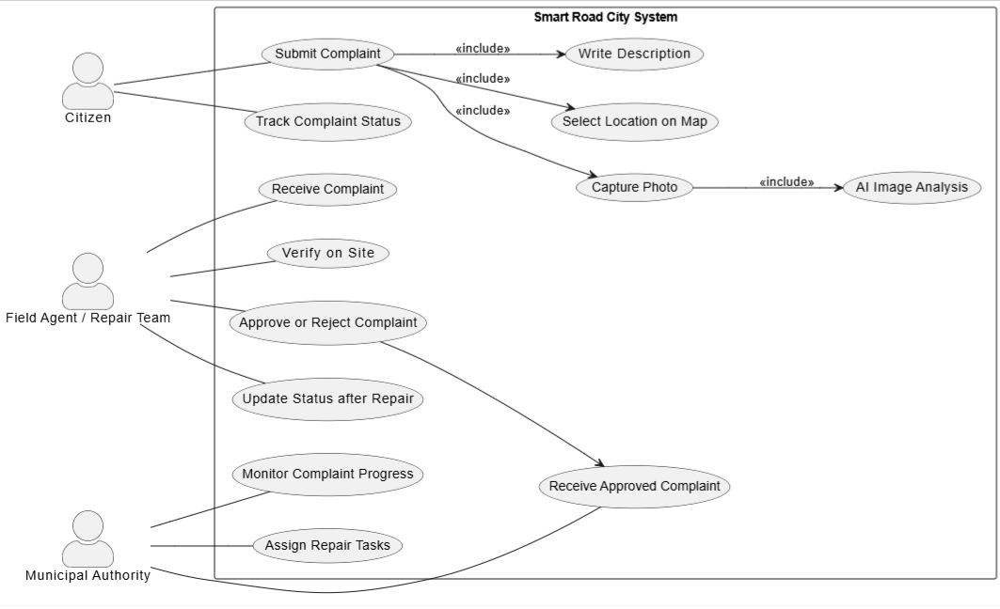
</div>

### Sequence Diagram
Chronological flow of a road damage report from initial capture to final repair verification.
<div align="center">
  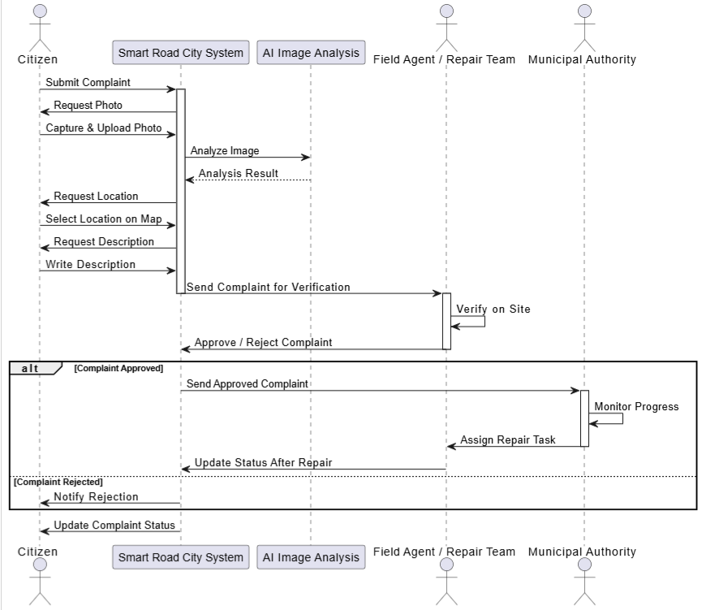
</div>

## Danger Scoring System

Every detection is assigned a **Danger Score (0-100%)** based on damage type and model confidence:
- 🔴 **Critical (0.75+)**: Potholes and major alligator cracks. (Priority: Immediate)
- 🟠 **High (0.50 - 0.74)**: Significant cracking. (Priority: High)
- 🟡 **Moderate (0.30 - 0.49)**: Developing cracks. (Priority: Medium)
- 🟢 **Low (< 0.30)**: Minor surface wear. (Priority: Low)

## Map Coverage

The application covers the greater **Tiaret region** with a hard-enforced boundary:
- **Radius**: 100km from center.
- **Total Area**: ~40,000 km².
- **Features**: Visual boundary indicators, restricted panning, and optimized zoom levels (9-18).

## Screenshots

### User Template
<div align="center">
  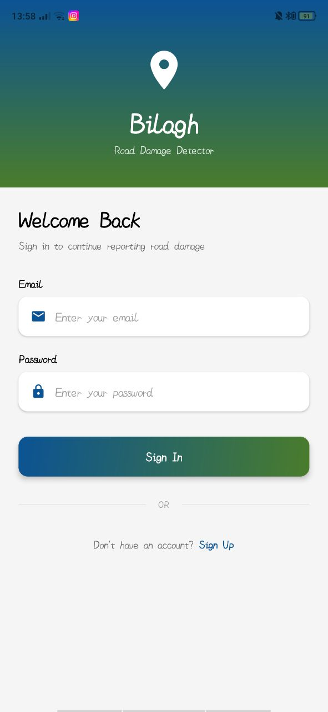
  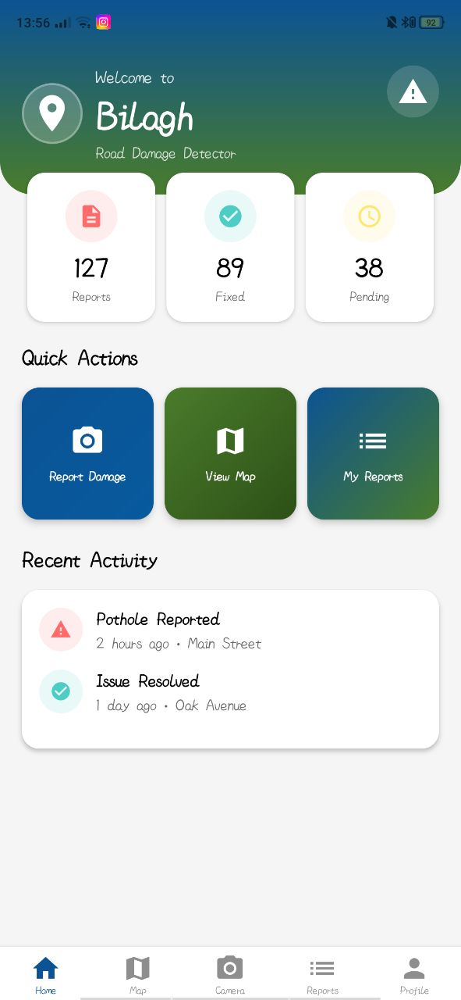
  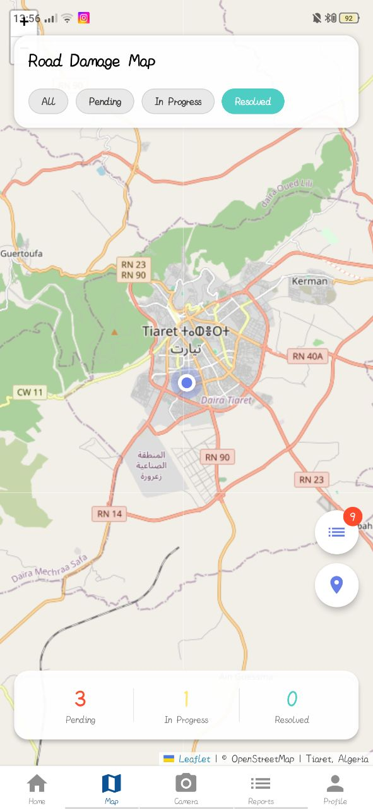
  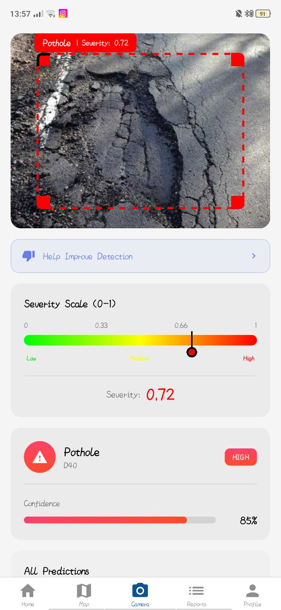
  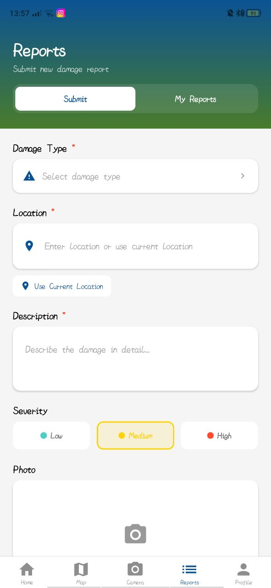
  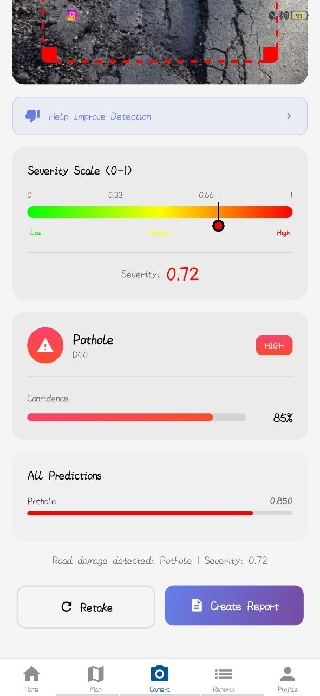
  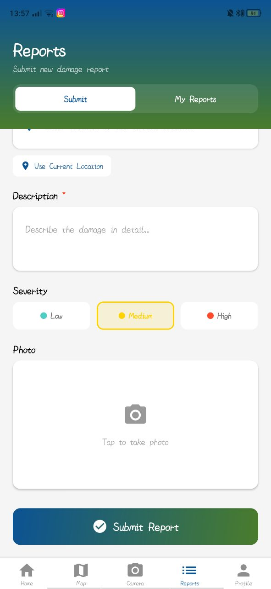
  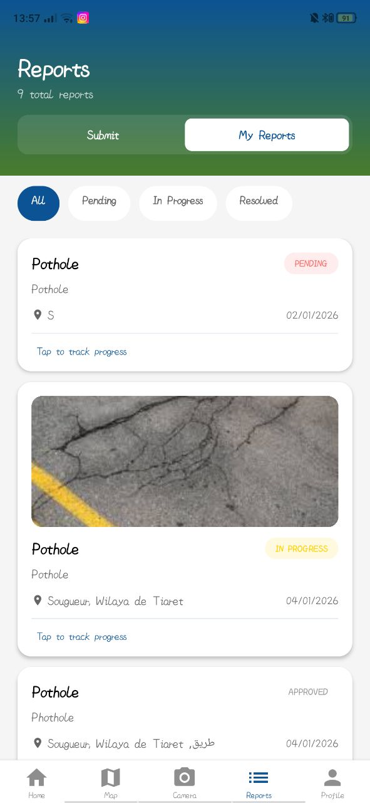
  
  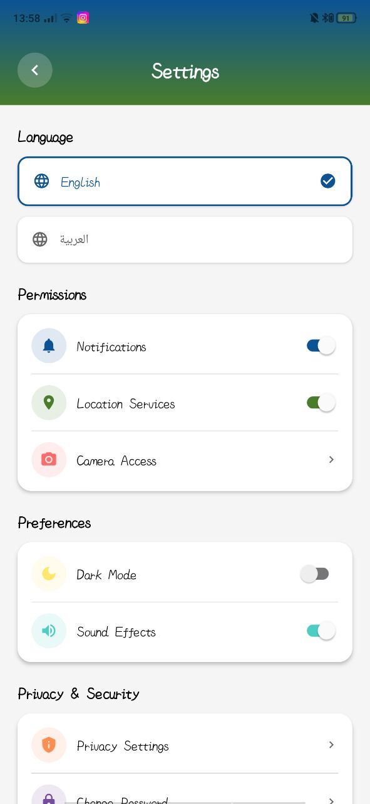
</div>

### Municipal Template
<div align="center">
  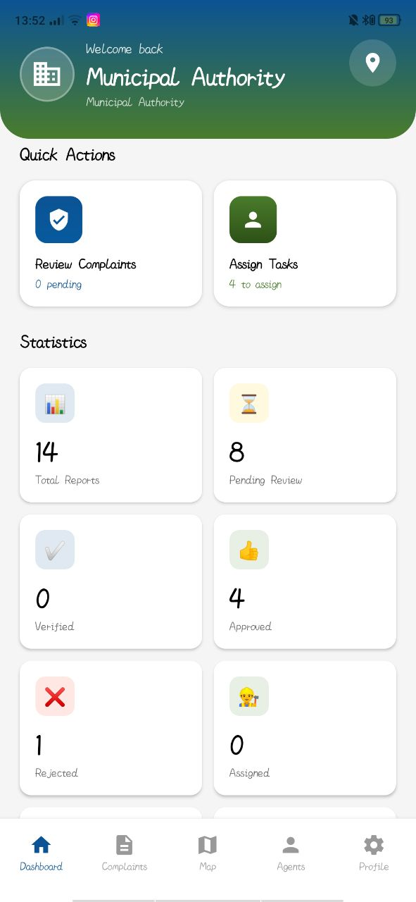
  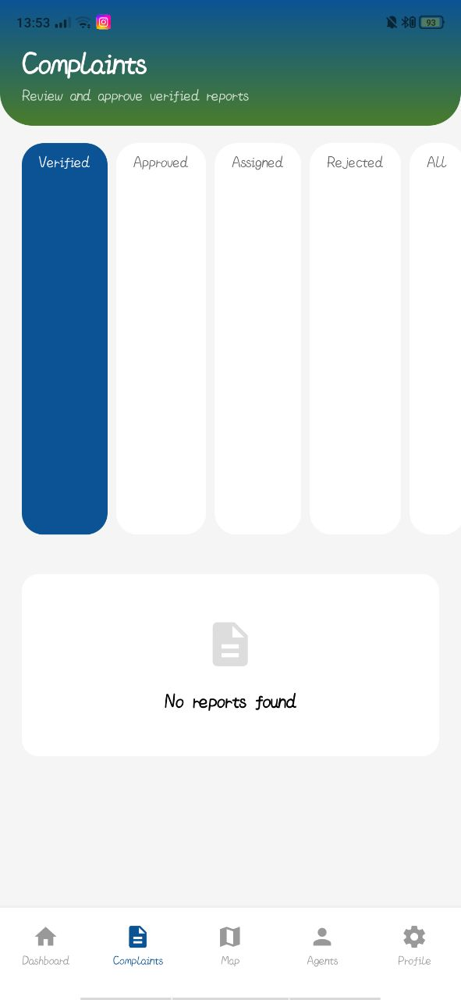
  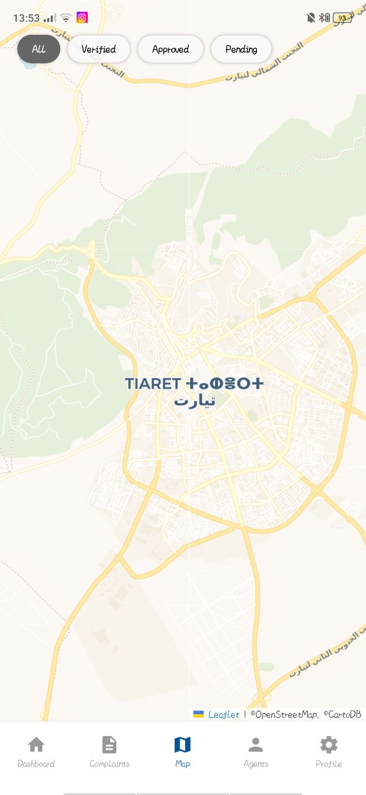
  
  
</div>

### Agent Template
<div align="center">
  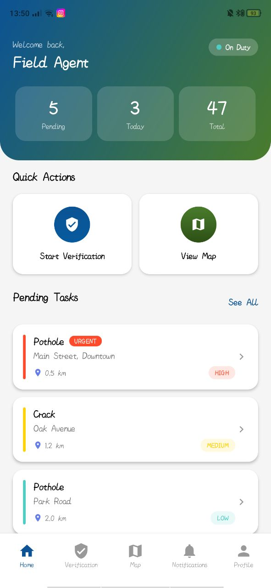
  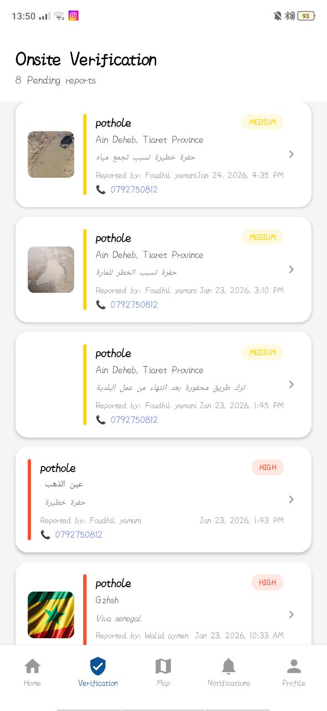
  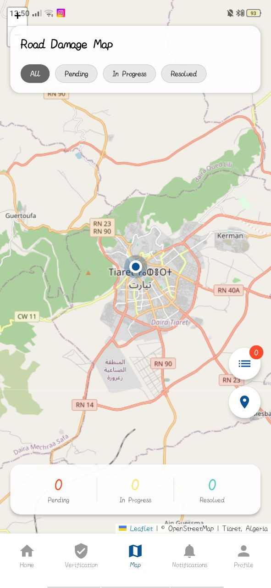
  
  
  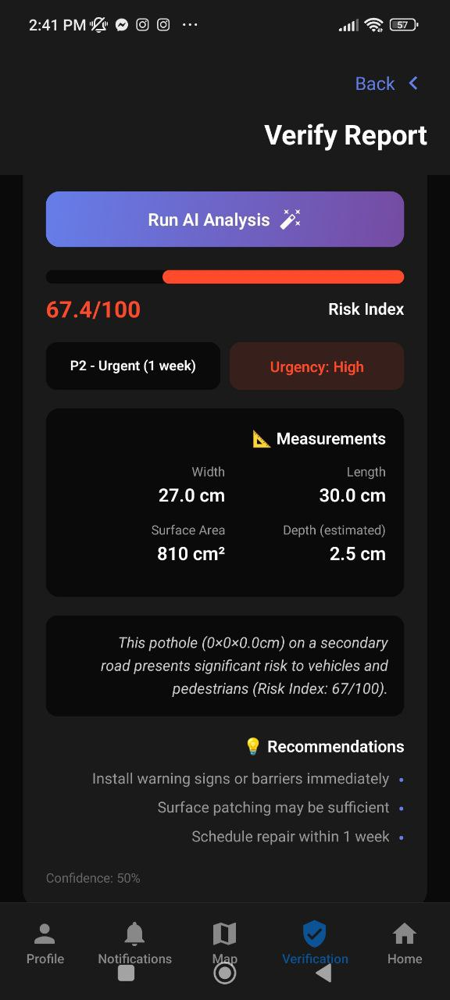
</div>

## Quick Start

```bash
# Install dependencies
npm install

# Start development server
npm start
```

## Tech Stack

- **Frontend**: React Native + Expo (TypeScript)
- **Backend**: FastAPI (Python)
- **Database**: MongoDB Atlas (Cloud NoSQL)
- **AI/ML**: Keras (Detection) + YOLOv8 (Classification)
- **Cloud**: Cloudinary (Media) + Railway (Hosting)
